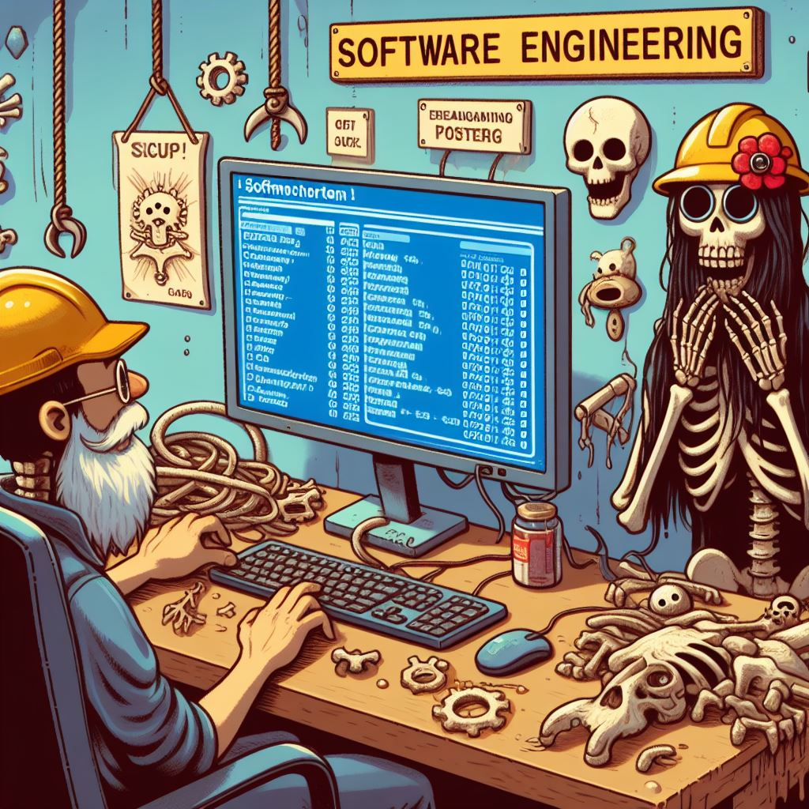
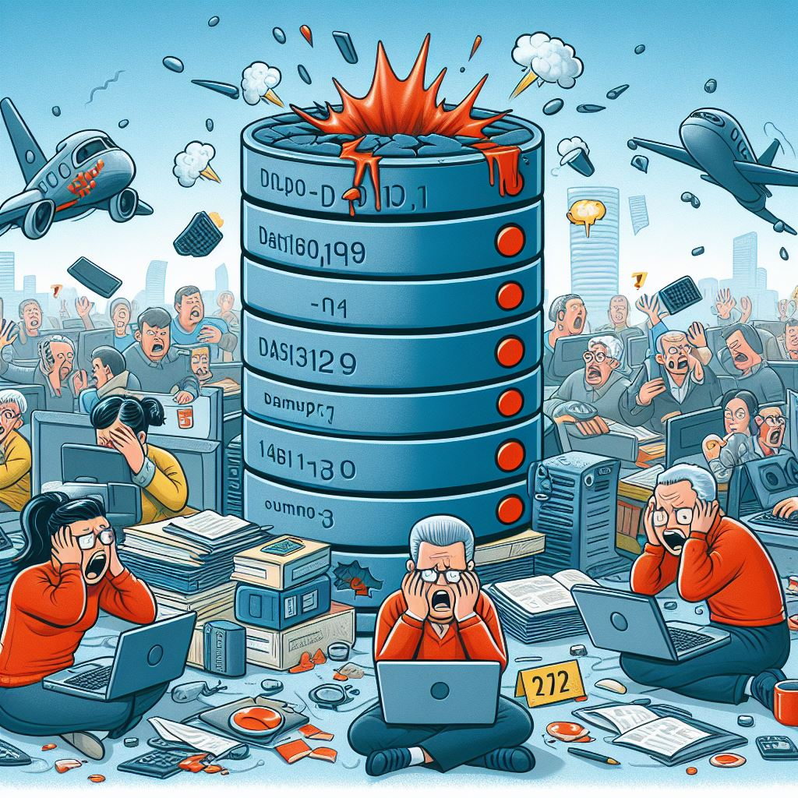
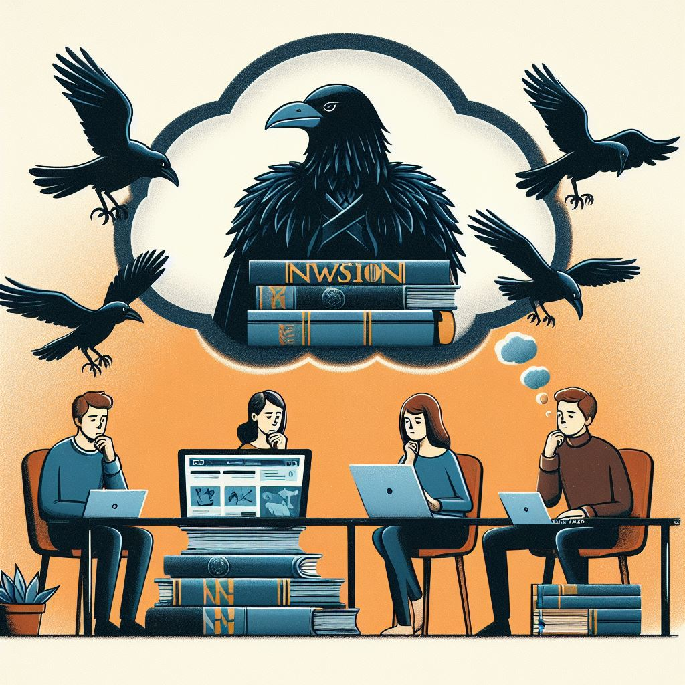
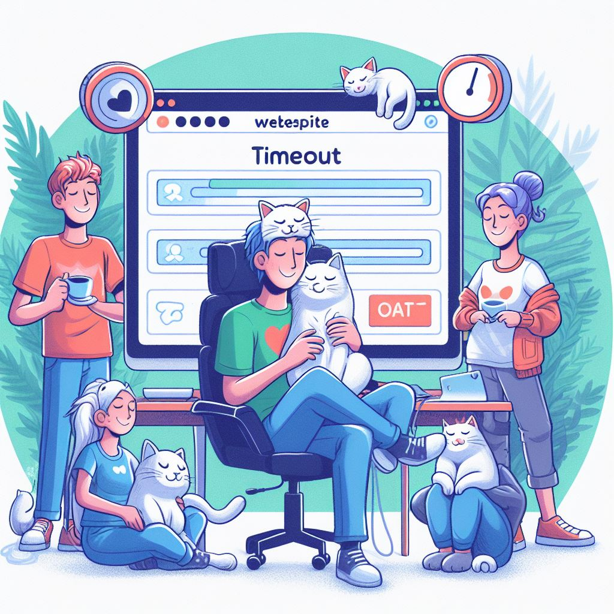

# The Great Database Lockout: A Postmortem of a Digital Drama

## Introduction
In the mystical realm of servers and databases, where bits and bytes dance to the rhythm of uptime, a fateful event unfolded.
Brace yourselves for "The Great Database Lockout of '24."

## Issue Summary

### Duration
From **14:00 to 16:30 SAST** on **May 8, 2024**
(or as we like to call it, the "Dark Ages of Data").

### Impact
Our beloved website decided to take a spontaneous vacation.
Users were left staring at loading spinners, contemplating life's mysteries, and wondering if they should switch to using the ravens from _Game of Thrones_ for communication.

Approximately **75%** of users experienced timeouts, while the remaining 25% were blissfully unaware because they were busy petting their cats (_meow!_).

### Root Cause
The database, feeling misunderstood and slightly melodramatic, locked itself in a digital panic room. It muttered, "I'm not angry; I'm just disappointed."
Turns out, it had a flair for theatrics.

## Timeline
1. **14:00 :** Our automated monitoring tools woke up from their nap, and shouted, "Houston, we have a problem!" The on-call engineer, still half-asleep, stumbled over to the keyboard.
2. **14:05 :** The engineer squinted at the screen, suspecting a network hiccup. But no, the network was sipping its coffee and minding its own business.

3. **14:20 :** The focus shifted to the database servers. The engineer whispered, "Are you okay, little database? Did someone hurt your feelings?"
4. **14:45 :** Misleading error logs pointed fingers at a potential security breach. The security team, now fully awake, donned their digital caps and rushed in.
5. **15:15 :** Security breach debunked. The real culprit? A rogue update script that had been bing-watching SQL tutorials and decided to rebel.
6. **15:30 :** Incident escalated to the database management team. They arrived with coffee mugs labeled "SQL Wizards."

7. **16:00 :** The database management team, armed with mystical books and ancient scrolls (okay, it was just a backup), terminated the misbehaving script.
8. **16:30 :** Service restored! The website emerged from its digital cocoon, blinking at the sunlight. Post-incident review scheduled, complete with celebratory virtual cake.

## Root Cause and Resolution

### Detailed Cause
The update script contained an incorrect SQL command. The database, feeling misunderstood, locked itself in protest. It muttered, "I'm not angry; I'm just misunderstood."

### Resolution Steps
The script was terminated, and the database was gently rolled back to a stable state using a recent backup. The database management team whispered sweet SQL queries to soothe its wounded pride.

## Corrective and Preventative Measures
1. **Improvements:**
	- Implement stricter code review processes for database scripts. No more rogue SQL adventurers!
	- Enhance monitoring to detect similar issues quicker. Our monitoring tools will now wear superhero capes.
	- Schedule regular training for engineers on incident response protocols. Because even databases need therapy sometimes.

## Conclusion
And there you have it-the epic saga of the Great Database Lockout!
Remember, fellow engineers, databases are sensitive souls; treat them kindly, and they'll keep your data safe.
Now go forth, share this tale, and prevent others from making the same mistakes.

